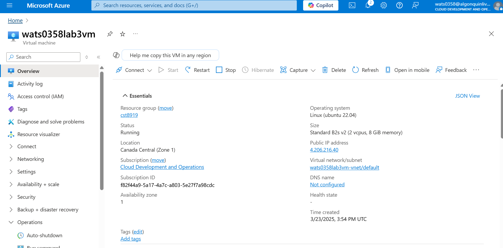
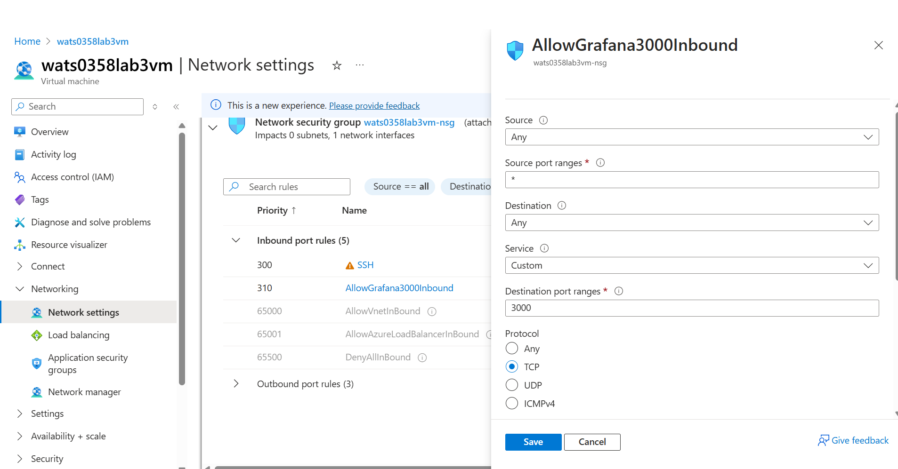
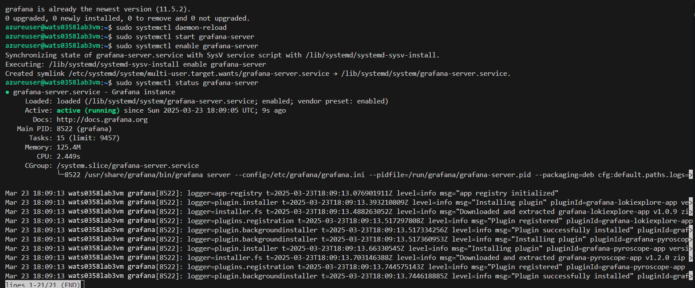
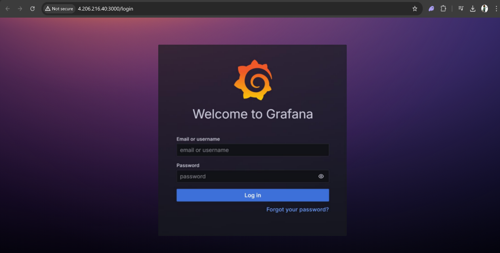
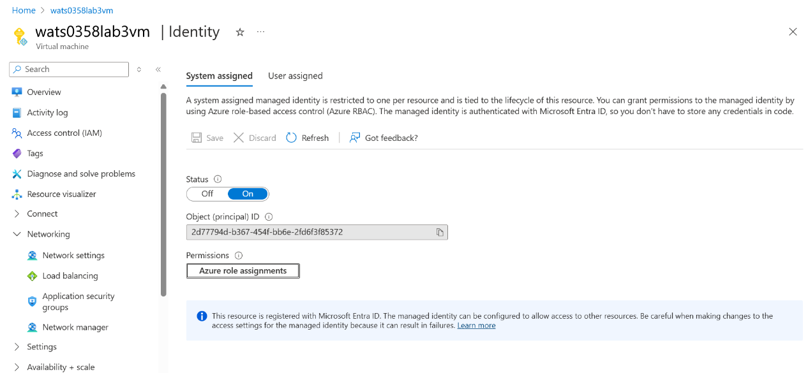
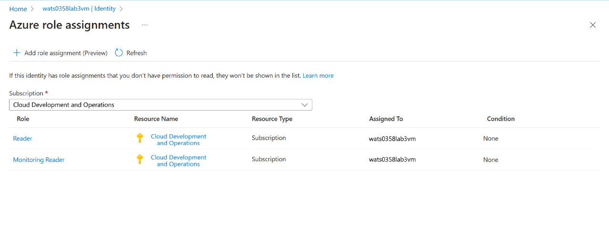
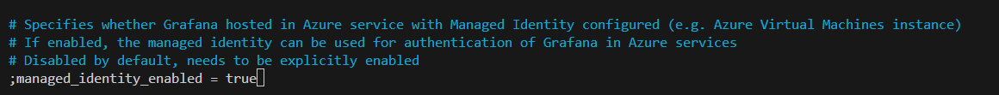
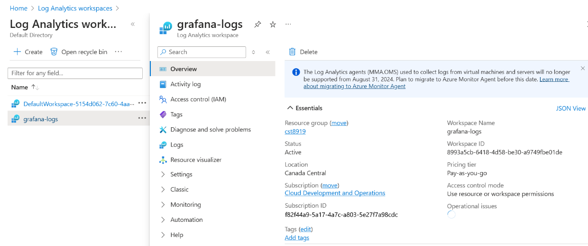
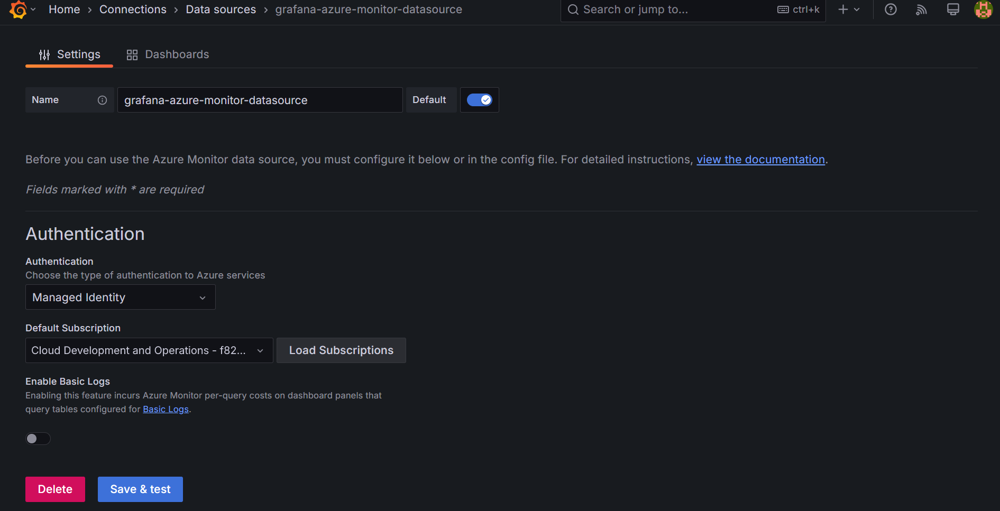
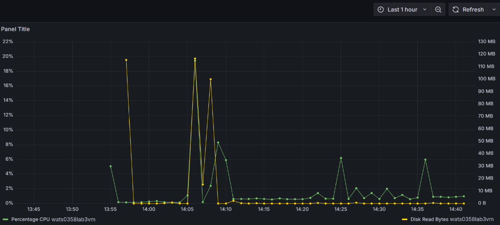

# cst8918-lab3
Lab 3 DevOps Security and Compliance wats0358

1. Create an Azure VM for a Ubuntu Server (18.04 or higher)

2. Enable Port 3000 for Grafana in our VM's network settings

3. Start and enable the grafana server in the terminal 

4. Verify that the grafana server is running by navigating to the IP

5. Enable managed identity in the VM's Security settings

6. Assign Monitor Reader and Reader roles in role assignment

7. Edit /etc/grafana/grafana.ini in the Grafana VM to have managed identity true

8. Create the log analytics workspace for Grafana in Azure

9. In Grafana, add the azure monitor data source and authenticate using managed identity

10. Create a dashboard and choose Azure Monitor as the data source

